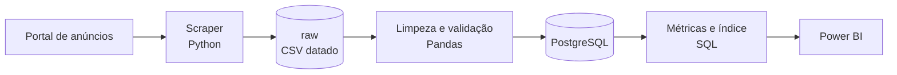

# GreenHome Porto

**Pipeline de dados end-to-end que cruza anúncios imobiliários com certificação energética para medir se a eficiência energética se reflete no preço da habitação no Porto.**

> **Estado:** 🚧 Em construção — etapa atual: **recolha de dados**.
> Este README descreve o que existe e marca como *planeado* o que ainda não foi construído.

---

## 1. Visão geral

### O problema
Em Portugal, a classe energética tem de constar de qualquer anúncio de venda de habitação — a informação existe, imóvel a imóvel. Mas está dispersa pelos portais e raramente é analisada de forma estruturada. Sem esse cruzamento, compradores, vendedores e financiadores decidem sem saber se a eficiência energética vale, ou não, dinheiro.

### A pergunta (v1)
**No Porto, o preço por m² pedido nos anúncios de habitação varia com a classe energética — e essa diferença mantém-se quando se compara dentro da mesma freguesia e tipologia?**

### Porquê importa
Se a eficiência energética se refletir no preço, é um fator de valor que o mercado já está a pagar. Para a banca é também uma questão de risco: com a revisão europeia da diretiva de desempenho energético dos edifícios (EPBD) e as exigências de reporte ESG, imóveis ineficientes podem desvalorizar — e esses imóveis são garantia de crédito à habitação.

### Âmbito

| Incluído (v1) | Fora do âmbito (v1) |
|---|---|
| Anúncios de venda de habitação no concelho do Porto | Outros concelhos |
| Preço pedido, área, tipologia, freguesia, classe energética | Preços de transação (escrituras) |
| Pipeline batch, execução manual | Recolha em tempo real / orquestração |

---

## 2. Arquitetura (planeada)



- **Padrão:** camadas *raw → processed → analytics* (inspirado na arquitetura medallion), processamento **batch**.
- **Porquê batch:** os anúncios mudam devagar e a pergunta é analítica, não operacional — recolhas pontuais chegam.

---

## 3. Stack

| Tecnologia | Para quê | Estado |
|---|---|---|
| Python 3.13 | Recolha e transformação | planeado |
| requests + BeautifulSoup ou Selenium | Scraping (conforme o portal) | a decidir |
| Pandas | Limpeza e validação | planeado |
| PostgreSQL | Armazenamento e consultas SQL | planeado |
| Power BI | Visualização | planeado |
| Git / GitHub | Versionamento | ✅ em uso |

---

## 4. Estrutura do repositório (alvo)

```
greenhome-porto/
├── data/
│   ├── raw/          # snapshots brutos, com data de recolha (nunca editados)
│   └── processed/    # dados limpos e validados
├── src/
│   ├── ingestion/    # scraper
│   ├── processing/   # limpeza e validação
│   └── analytics/    # métricas e índice
├── sql/              # criação de tabelas e consultas
├── tests/            # testes
├── docs/             # dicionário de dados e decisões
├── .env.example      # variáveis de ambiente (sem valores reais)
├── requirements.txt
├── WORKLOG.md        # registo de progresso
└── README.md
```

> As pastas são criadas quando a etapa correspondente começa.

---

## 5. Dados

**Fonte:** [SuperCasa](https://supercasa.pt) (anúncios de venda de habitação) — recolha respeitando os termos de utilização e o `robots.txt` do site.

### Dicionário de dados (proposta v1)

| Campo | Tipo | Descrição |
|---|---|---|
| `url` | texto | Endereço do anúncio (identificador único) |
| `data_recolha` | data | Dia em que o anúncio foi recolhido |
| `preco` | número (€) | Preço pedido |
| `area_m2` | número | Área útil |
| `preco_m2` | número (€/m²) | `preco / area_m2` (calculado) |
| `tipologia` | texto | T0, T1, T2… |
| `freguesia` | texto | Freguesia do Porto |
| `classe_energetica` | texto | A+ a F |

### Regras de qualidade (v1)

- `url` único (sem duplicados)
- `preco` e `area_m2` maiores que zero
- `classe_energetica` ∈ {A+, A, B, B-, C, D, E, F}
- `preco_m2` dentro de um intervalo plausível (limites definidos na etapa de limpeza e documentados em `docs/`)
- Registos que falham uma regra são contados e reportados, não apagados em silêncio

---

## 6. Como executar

> Disponível quando a primeira etapa (scraper) estiver concluída.

```bash
git clone https://github.com/aavelarbelo/greenhome-porto.git
cd greenhome-porto
python -m venv .venv
.venv\Scripts\activate        # Windows
pip install -r requirements.txt
copy .env.example .env        # preencher com as credenciais locais
```

**Segurança:** credenciais (base de dados, chaves de API) vivem só no `.env`, que está no `.gitignore` e nunca é publicado.

---

## 7. Roadmap

- [x] Definição da pergunta e do âmbito
- [ ] Scraper (uma fonte, poucas freguesias)
- [ ] Snapshot bruto datado
- [ ] Limpeza e validação (com relatório de qualidade)
- [ ] Base PostgreSQL (schema, carga, consultas)
- [ ] Índice (fórmula simples e justificada)
- [ ] Dashboard Power BI
- [ ] Testes automáticos das regras de qualidade

---

## 8. Limitações conhecidas

- Os preços são **pedidos** (anúncios), não preços de venda.
- A amostra depende do que o portal publica — não representa todo o mercado.
- A análise mostra **associação**, não causalidade: uma casa eficiente pode ser mais cara por outras razões (localização, idade, estado).

---

## Origem e autoria

A ideia nasceu de um trabalho de grupo da Pós-Graduação em Big Data & Decision Making (ISEP, 2026). Esta versão é individual e reconstruída de raiz: recolha, modelação e análise próprias.

**Autora:** Andressa Avelar Belo — [LinkedIn](https://linkedin.com/in/andressaavelar) · [GitHub](https://github.com/aavelarbelo)

**Licença:** MIT
